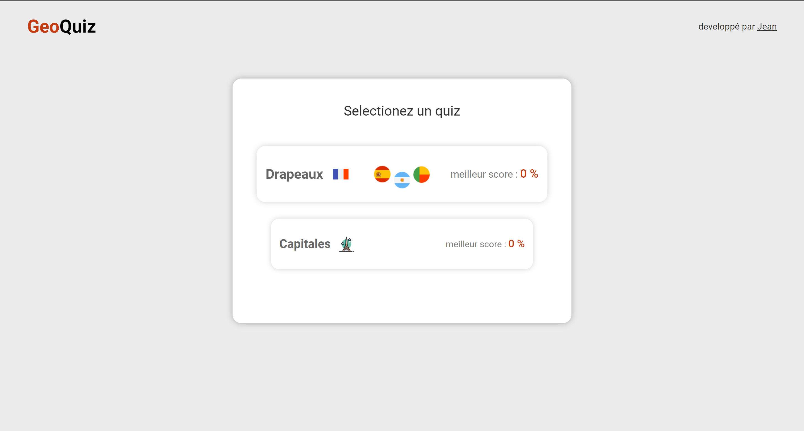
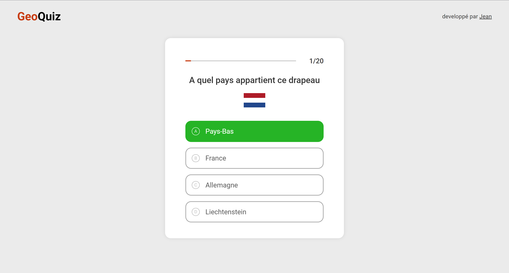

<!-- Please update value in the {}  -->

<h1 align="center">{GeoQuiz}</h1>

   A small quiz app about flags and capitales using Vanilla Javascript and pure CSS

  <h3>
    See the Demo 
    <a href="https://j0suke.github.io/Geography-quiz-app/" targer="_blank">
      here
    </a>
  </h3>

## Table of Contents

- [Overview](#overview)
  - Built With HTML , pure CSS , Vanilla JS
- [Features](#features)
  - Modern CSS design , Using REST API

## Overview

## Contact

- GitHub [@J0SUKE](https://github.com/J0SUKE/)
- Twitter [@Jean](https://twitter.com/Jean_M_____I)
